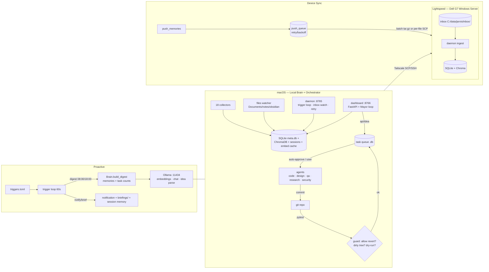

# Jarvis — System & Workflow Diagram

> Rendered after Round 5 (2026-08-06). ASCII for terminals; Mermaid renders on GitHub/Obsidian.
> Architecture: thin-client. Lightspeed is the authoritative brain/server; the Mac is a
> terminal + collectors with a disposable cache (write-outbox + rolling read-tail).

## 1) Architecture map

```
┌──────────────────────────────────────────────────────────────────────────────┐
│                          JARVIS — SYSTEM OVERVIEW                            │
└──────────────────────────────────────────────────────────────────────────────┘

  MAC  (lucasdespot — local brain + orchestrator)
  ════════════════════════════════════════════════════════════════════════════
  launchd agents                                    cron (macOS)
  ├─ com.user.jarvis  ──► service.py                ├─ 03:00  scan --source all
  │      └─► daemon (sync.daemon)                     │        + push_memories
  │           ├─ inbox watch (data/inbox)            ├─ 03:15  promote-daily.sh
  │           ├─ HTTP API  :8765                       (promote + reindex)
  │           ├─ retry loop
  │           └─ trigger loop ──► triggers.toml
  ├─ com.user.jarvis-watcher ──► collectors/files.py  (Documents/notes/obsidian)
  ├─ com.user.jarvis-sync  (scheduled, Sun 23:00)
  └─ com.jarvis.dashboard ──► FastAPI :8766 + Mayor loop
        ├─ /dashboard/*  pages: memories · graph · alerts · thoughts · queue
        ├─ /api/*        idea · tasks · status · entities(+relationships)
        └─ Mayor: idea → task queue → agents → test & guarded auto-revert
            └─ idle maintenance (reindex ~5m · promote ~6h · /api/ps guard)

  COLLECTORS ──► 18 sources (files, browser, calendar, email, photos, rss,
                              system, deep, git, shell, notes, reminders,
                              contacts, messages, kilo, …)
        │
        ▼
  STORE  (local · profile-aware via paths.py)
  ├─ SQLite meta.db    memories · sync_log · decision_log · entities ·
  │                     memory_entities · relationships · push_queue
  ├─ ChromaDB          vector index (embeddings for semantic search)
  ├─ sessions.db       multi-turn chat sessions
  └─ embed_cache.db    embedding cache (no repeated Ollama calls)
        │                   │
        ▼                   ▼
  QUERY / AGENT          KNOWLEDGE GRAPH
  ├─ brain.query         graph.py + extract_entities
  ├─ agent.py (8 tools)  /api/entities · /api/entities/{id}/relationships
  │   RAG injects        surfaced in search · chat · dashboard
  │   related entities
  └─ CLI: chat · search · remember · reindex · promote · export · task · …

  TRIGGERS (proactive)          MAINTENANCE (decay)
  ├─ 08:00 morning brief :      └─ raw ──(7 days)──► session ──► reflection ──► arc
  │     Brain.build_digest(          (weight 0.3 → 0.6 → 1.0 → 1.5)
  │       memories + task queue)
  ├─ 18:00 end-of-day wrap
  └─ actions: notify · brief file · session-tier memory · escalate

  PUSH ARM (device → server)
  └─ push_memories ──► durable queue (push_queue) ──► batch tar.gz (or per-file)
        │            retry + backoff [1m,5m,30m,2h] · nothing dropped offline
        ▼  SCP over Tailscale
  LIGHTSPEED  (Dell G7 · Windows · server role)
  ├─ inbox  C:/data/jarvis/inbox/<device_id>/
  ├─ daemon ingests pushed .txt + .json sidecars
  ├─ SQLite + Chroma  (authoritative remote store)
  └─ Ollama :11434     embeddings (nomic-embed-text) · chat (qwen2.5:7b) ·
                       idea parsing (llama3.2:1b)
```

## 2) Data & work workflow

```
    COLLECT            PROCESS              STORE                 USE
 ┌──────────┐   ┌────────────────┐   ┌───────────────┐   ┌────────────────────┐
 │ files    │   │ chunk_document │   │ SQLite meta   │   │ brain.query ● RAG  │
 │ browser  │──►│ embed (cache)  │──►│  + tier/route │──►│ agent (tools loop) │
 │ calendar │   │ classify/route │   │ ChromaDB vec  │   │ dashboard          │
 │ email…   │   │ extract entity │   │ graph tables  │   │ CLI search/chat    │
 └──────────┘   └────────────────┘   └───────────────┘   └────────┬───────────┘
        ▲                                                        │
        │  reindex missing embeddings                           answer
        │  promote raw→session                                   │
        └──────────────── (idle maintenance / daily cron) ───────┘

    PROACTIVE:  triggers → digest(brain+queue) → notify/brief/session-memory
    AUTONOMOUS: idea → Mayor parse → task queue → user approve → agent →
                git commit → pytest → auto-revert (guarded: dry-run / dirty tree)
    DEVICE SYNC: memories → push_queue → batch SCP → Lightspeed inbox → ingest
```

## 3) Mermaid (renders on GitHub / Obsidian)


